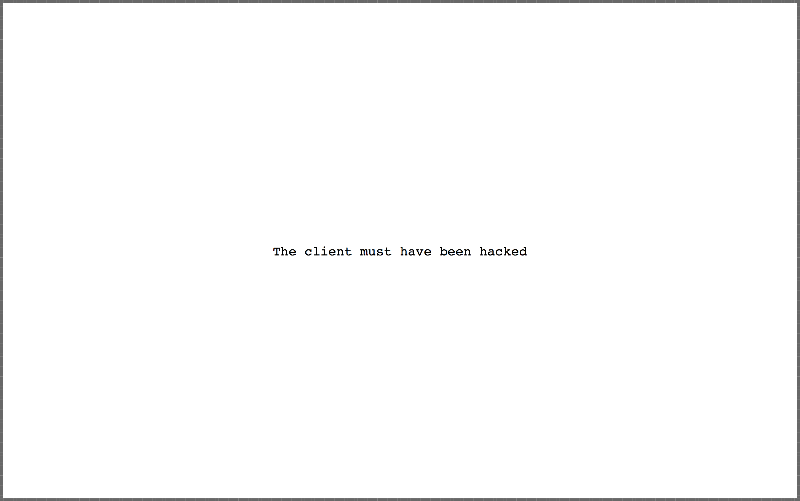

# DeveloperExcuses.saver

## Proudly powered by [OnelinerKit](https://github.com/kimar/OnelinerKit).

Dead simple Screensaver which periodically shows a quote from [http://developerexcuses.com](http://developerexcuses.com), that's it.

Not officially affiliated with [http://developerexcuses.com](http://developerexcuses.com)

Grab the current [Release here](Release/DeveloperExcuses.saver.zip)!

And feel free to fork and contribute ;-)

## Getting started

Open up *DeveloperExcuses.xcodeproj* using Xcode and hit Cmd+B to build it. That's it.

## License

See [LICENSE.md](LICENSE.md)
